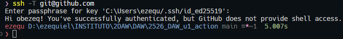

# 1. Actividad: *GitHub Actions: entendiendo Workflow.*

## 🎯 Objetivos de aprendizaje

* Comprender la estructura de un workflow (`on`, `jobs`, `steps`).

   * Ejecutar tests automáticamente en GitHub.
   * Automatizar la actualización del `README.md` con el resultado.
 
* Explorar mejoras progresivas para descubrir el potencial de GitHub Actions.

---

## 📝 Contexto

Partimos de un **repositorio base** que contiene:

* Un programa sencillo (`main.py`).
* Un test unitario (`test_main.py`).
* Un script (`update_readme.py`) que ejecuta los tests y modifica el `README.md`, con el resultado de ejecutar los test.
* El workflow básico (`ci.yml`) que ejecuta el script y hace commit automático con `git-auto-commit-action`.

---

## 🔹 Parte 1: Workflow básico. Ya implementado.

1. El alumno clona el repositorio base.
2. Comprende el contenido del script y del workflow.
3. Ejecuta el workflow manualmente y comprueba que el `README.md` se actualiza con una de estas dos salidas:

   * ✅ *Tests correctos*
   * ❌ *Tests fallidos*

---

## 🔹 Parte 2: Mejora obligatoria (nivel básico)

Cada alumno debe implementar al menos una de estas mejoras:

* **Historial de resultados en el README:** en lugar de sobrescribir, añadir nuevas líneas con fecha/hora.
* **Generar un archivo `report.md`:** con más detalles de la ejecución (tests pasados, fallidos, tiempo).

---

## 📑 Entregables

Cada alumno debe entregar:

1. Enlace a su repositorio con el workflow funcionando.
2. Evidencia en el historial de commits de:

   * Al menos un test correcto y uno fallido de la solución entregada.
   * Una mejora implementada (historial, report.md, badge o equivalente).
3. Breve documento (README_mejora.md) explicando:

   * Qué mejoras ha implementado.
   * Qué hace tu workflow.

---

## 📌 Evaluación (rúbrica simplificada)

* ✅ Workflow básico funciona y modifica el README.
* ✅ Al menos una mejora implementada.
* ✅ Explicación clara del funcionamiento y ventajas.


---

# 2. SOLUCIÓN: "GitHub Actions + Python Script + Auto Commit"

## 📝 Preparación del repositorio base

Estructura:

```
mi-proyecto-actions/
 ├── main.py
 ├── test_main.py
 ├── update_readme.py   👈 nuevo script
 └── README.md
```


### README.md inicial   

Una posible versión base del fichero README.md sería el siguiente (aunque finalmente será mas completo): 


```markdown
# Mi Proyecto con GitHub Actions

Este proyecto sirve para aprender a usar GitHub Actions 🚀

## 3stado de los tests
*Aún no ejecutados...*
```

### main.py   

Un ejemplo básico, que contiene una función saludo.  Puedes modificar la función cuando quieres que falle. 

```python
def saludo(nombre: str) -> str:
    return f"Hola, {nombre}!"
```

### test\_main.py    

Un test básico. 

```python
from main import saludo

def test_saludo():
    assert saludo("Mundo") == "Hola, Mundo!"
```

---

## 🐍 Script en Python (`update_readme.py`)

Script en python. Este script ejecuta los tests y actualiza el README:

```python
import subprocess

def run_tests():
    try:
        subprocess.check_call(["pytest", "-q"])
        return "✅ Tests correctos"
    except subprocess.CalledProcessError:
        return "❌ Tests fallidos"

def update_readme(status: str):
    with open("README.md", "r", encoding="utf-8") as f:
        lines = f.readlines()

    new_lines = []
    for line in lines:
        new_lines.append(line)
        if line.strip() == "## Estado de los tests":
            new_lines.append(status + "\n")
            break

    with open("README.md", "w", encoding="utf-8") as f:
        f.writelines(new_lines)

if __name__ == "__main__":
    status = run_tests()
    update_readme(status)
```

👉 Lo que hace:

1. Ejecuta los tests con `pytest`.
2. Según el resultado, genera un estado ✅ o ❌.
3. Modifica el `README.md` justo debajo de la sección `## 3stado de los tests`.

---

## ⚙️ Workflow (`.github/workflows/ci.yml`)

El workflow que gúía el github action:   

```yaml
name: CI con AutoCommit

on:
  push:
    branches: [ "main" ]
  workflow_dispatch:

permissions:
  contents: write   # 👈 IMPORTANTE: permite que el bot pueda hacer commits/push

jobs:
  test-and-update:
    runs-on: ubuntu-latest
    steps:
      - name: Checkout repo
        uses: actions/checkout@v3

      - name: Configurar Python
        uses: actions/setup-python@v4
        with:
          python-version: '3.10'

      - name: Instalar dependencias
        run: pip install pytest

      - name: Ejecutar script de tests y actualizar README
        run: python update_readme.py

      - name: Commit automático del README
        uses: stefanzweifel/git-auto-commit-action@v5
        with:
          commit_message: "Update README con estado de tests"
          file_pattern: README.md
```

---

## 🚦 Flujo de la actividad

1. Cuando se haga un **push** en `main`.
2. Se le da permiso de escritura para hacer commits/push al repositorio.
3. El workflow ejecuta el script en Python.
4. El script corre los tests y modifica el `README.md`.
5. La acción `git-auto-commit-action` hace commit automático con los cambios.
6. El alumno ve en el repo cómo el `README.md` se actualiza con:
    
    * ✅ Tests correctos
    * ❌ Tests fallidos

---

# 3. POSIBLES MEJORAS AL EJEMPLO ANTERIOR

La idea es que no solo no repitais el ejemplo, sino que **investigueis, mejoreis y veais el potencial real de GitHub Actions**. Para ello se piden funcionalidades **extra e imaginativas**. Aqui teneis varias propuestas, de más sencillas a más potentes, todas pensadas para que veais ventajas prácticas:

---

## 💡 Mejoras propuestas para el Action

### 1. **Historial en el README**

* Que en lugar de sobrescribir el estado, **guarden un histórico** en el README:
  
  ```markdown
  ## 3stado de los tests
  - ✅ 2025-09-22 18:00 - Tests correctos
  - ❌ 2025-09-22 17:45 - Tests fallidos
  ```
  
* 👉 Aprenderás a  **manejar fechas** y a **modificar archivos de forma acumulativa**.

---

### 2. **Generar un `report.md` con detalles**

* Crear un archivo `test-report.md` con:
    
    * Número total de tests.
    * Tests pasados y fallidos.
    * Tiempo de ejecución.

* 👉 Aprenderás a  **exportar resultados de procesos** y tener **documentación viva** del proyecto.

---

### 3. **Badges automáticos en README**

* Añadir un **badge** dinámico al README con el estado:
    
    * Verde = Tests correctos
    * Rojo = Tests fallidos
* Usando [shields.io](https://shields.io/) o generando un badge local en SVG.

* 👉 Entenderás cómo **mejorar la comunicación del estado** de un proyecto.

---

### 4. **Notificaciones externas**

* Enviar el resultado a:
    
    * **Slack/Discord** (webhook sencillo).
    * **Email** (con una acción de envío).

* 👉 Descrubrirás que Actions también sirve para **integrar con herramientas externas**.

---

### 5. **Ejecutar en múltiples entornos (matrix)**

* Hacer que los tests se ejecuten en:
    
    * Varias versiones de Python (`3.8`, `3.9`, `3.10`).
    * O en Linux y Windows.
     
* 👉 Verás la potencia del `strategy.matrix` y comprobarás compatibilidad multiplataforma.

---

### 6. **Programar ejecución automática**

* Añadir `schedule` para que se ejecute cada día a medianoche.
* El README mostraría:
  
  ```
  ✅ Última comprobación automática: 2025-09-22 00:00
  ```

* 👉 Aprenderás a **programar tareas recurrentes**.

---

### 7. **Generar una página web de resultados**

* Publicar los resultados en GitHub Pages (`gh-pages`) usando `peaceiris/actions-gh-pages`.
* 👉 Visualizarás cómo GitHub Actions puede hacer **CI/CD real** (tests + despliegue).

---

### 8. **Crear Issues automáticos si fallan los tests**

* Si un test falla → abrir un **issue automático** en el repositorio:
  
  ```yaml
  - uses: actions/github-script@v7
    with:
      script: |
        github.issues.create({
          owner: context.repo.owner,
          repo: context.repo.repo,
          title: "❌ Tests fallidos",
          body: "Se han detectado errores en los tests. Revisa el último commit."
        })
  ```
* 👉 Aprenderás a **automatizar la gestión de incidencias**.

---

## 🎯 Aprendizaje con estas mejoras

Con estas extensiones conseguireis:

* Experimentar **cómo GitHub Actions conecta piezas del desarrollo real** (tests, docs, issues, notificaciones, despliegues).
* Entender la **ventaja competitiva** de CI/CD: feedback inmediato, documentación viva y automatización.
* Pasar de un ejemplo didáctico a un flujo de trabajo que se parece mucho al que usan empresas reales.

---

# Mi Proyecto con GitHub Actions


Este proyecto sirve para aprender a usar GitHub Actions 🚀

## Estado de los tests
- ✅  2026-01-16 02:12 - Tests correctos (automática)
- ✅  2026-01-15 02:10 - Tests correctos (automática)
- ✅  2026-01-14 02:22 - Tests correctos (automática)
- ✅  2026-01-13 02:08 - Tests correctos (automática)
- ✅  2026-01-12 02:23 - Tests correctos (automática)
- ✅  2026-01-11 02:27 - Tests correctos (automática)
- ✅  2026-01-10 02:07 - Tests correctos (automática)
- ✅  2026-01-09 02:11 - Tests correctos (automática)
- ✅  2026-01-08 02:10 - Tests correctos (automática)
- ✅  2026-01-07 02:10 - Tests correctos (automática)
- ✅  2026-01-06 02:10 - Tests correctos (automática)
- ✅  2026-01-05 02:27 - Tests correctos (automática)
- ✅  2026-01-04 02:27 - Tests correctos (automática)
- ✅  2026-01-03 02:04 - Tests correctos (automática)
- ✅  2026-01-02 02:10 - Tests correctos (automática)
- ✅  2026-01-01 02:26 - Tests correctos (automática)
- ✅  2025-12-31 02:09 - Tests correctos (automática)
- ✅  2025-12-30 02:08 - Tests correctos (automática)
- ✅  2025-12-29 02:23 - Tests correctos (automática)
- ✅  2025-12-28 02:25 - Tests correctos (automática)
- ✅  2025-12-27 02:05 - Tests correctos (automática)
- ✅  2025-12-26 02:07 - Tests correctos (automática)
- ✅  2025-12-25 02:08 - Tests correctos (automática)
- ✅  2025-12-24 02:06 - Tests correctos (automática)
- ✅  2025-12-23 02:08 - Tests correctos (automática)
- ✅  2025-12-22 02:13 - Tests correctos (automática)
- ✅  2025-12-21 02:19 - Tests correctos (automática)
- ✅  2025-12-20 02:00 - Tests correctos (automática)
- ✅  2025-12-19 02:06 - Tests correctos (automática)
- ✅  2025-12-18 02:03 - Tests correctos (automática)
- ✅  2025-12-17 02:03 - Tests correctos (automática)
- ✅  2025-12-16 02:08 - Tests correctos (automática)
- ✅  2025-12-15 02:11 - Tests correctos (automática)
- ✅  2025-12-14 02:19 - Tests correctos (automática)
- ✅  2025-12-13 02:00 - Tests correctos (automática)
- ✅  2025-12-12 02:07 - Tests correctos (automática)
- ✅  2025-12-11 02:07 - Tests correctos (automática)
- ✅  2025-12-10 02:06 - Tests correctos (automática)
- ✅  2025-12-09 02:04 - Tests correctos (automática)
- ✅  2025-12-08 02:05 - Tests correctos (automática)
- ✅  2025-12-07 02:18 - Tests correctos (automática)
- ✅  2025-12-06 01:57 - Tests correctos (automática)
- ✅  2025-12-05 02:04 - Tests correctos (automática)
- ✅  2025-12-04 02:04 - Tests correctos (automática)
- ✅  2025-12-03 02:02 - Tests correctos (automática)
- ✅  2025-12-02 02:03 - Tests correctos (automática)
- ✅  2025-12-01 02:26 - Tests correctos (automática)
- ✅  2025-11-30 02:12 - Tests correctos (automática)
- ✅  2025-11-29 01:58 - Tests correctos (automática)
- ✅  2025-11-28 01:58 - Tests correctos (automática)
- ✅  2025-11-27 01:58 - Tests correctos (automática)
- ✅  2025-11-26 02:01 - Tests correctos (automática)
- ✅  2025-11-25 02:01 - Tests correctos (automática)
- ✅  2025-11-24 02:07 - Tests correctos (automática)
- ✅  2025-11-23 02:19 - Tests correctos (automática)
- ✅  2025-11-22 01:54 - Tests correctos (automática)
- ✅  2025-11-21 01:58 - Tests correctos (automática)
- ✅  2025-11-20 01:57 - Tests correctos (automática)
- ✅  2025-11-19 01:59 - Tests correctos (automática)
- ✅  2025-11-18 01:59 - Tests correctos (automática)
- ✅  2025-11-17 02:01 - Tests correctos (automática)
- ✅  2025-11-16 02:06 - Tests correctos (automática)
- ✅  2025-11-15 01:56 - Tests correctos (automática)
- ✅  2025-11-14 02:00 - Tests correctos (automática)
- ✅  2025-11-13 02:02 - Tests correctos (automática)
- ✅  2025-11-12 02:00 - Tests correctos (automática)
- ✅  2025-11-11 02:01 - Tests correctos (automática)
- ✅  2025-11-10 02:05 - Tests correctos (automática)
- ✅  2025-11-09 02:04 - Tests correctos (automática)
- ✅  2025-11-08 01:54 - Tests correctos (automática)
- ✅  2025-11-07 01:58 - Tests correctos (automática)
- ✅  2025-11-06 02:00 - Tests correctos (automática)
- ✅  2025-11-05 02:00 - Tests correctos (automática)
- ✅  2025-11-04 01:58 - Tests correctos (automática)
- ✅  2025-11-03 02:05 - Tests correctos (automática)
- ✅  2025-11-02 02:04 - Tests correctos (automática)
- ✅  2025-11-01 02:01 - Tests correctos (automática)
- ✅  2025-10-31 01:58 - Tests correctos (automática)
- ✅  2025-10-30 02:01 - Tests correctos (automática)
- ✅  2025-10-29 02:04 - Tests correctos (automática)
- ✅  2025-10-28 01:56 - Tests correctos (automática)
- ✅  2025-10-27 02:07 - Tests correctos (automática)
- ✅  2025-10-26 02:01 - Tests correctos (automática)
- ✅  2025-10-25 01:52 - Tests correctos (automática)
- ✅  2025-10-24 01:51 - Tests correctos (automática)
- ✅  2025-10-23 01:54 - Tests correctos (automática)
- ✅  2025-10-22 01:59 - Tests correctos (automática)
- ✅  2025-10-21 01:57 - Tests correctos (automática)
- ✅  2025-10-20 02:04 - Tests correctos (automática)
- ✅  2025-10-19 02:07 - Tests correctos (automática)
- ✅  2025-10-18 01:47 - Tests correctos (automática)
- ✅  2025-10-17 01:52 - Tests correctos (automática)
- ✅  2025-10-16 01:55 - Tests correctos (automática)
- ✅  2025-10-15 01:56 - Tests correctos (automática)
- ✅  2025-10-14 01:52 - Tests correctos (automática)
- ✅  2025-10-13 02:00 - Tests correctos (automática)
- ✅  2025-10-12 01:55 - Tests correctos (automática)
- ✅  2025-10-11 01:48 - Tests correctos (automática)
- ✅  2025-10-10 01:53 - Tests correctos (automática)
- ✅  2025-10-09 20:21 - Tests correctos
- ✅  2025-10-09 19:40 - Tests correctos
- ✅  2025-10-09 01:12 - Tests correctos (automática)
- ✅  2025-10-08 01:11 - Tests correctos (automática)
- ✅  2025-10-07 01:11 - Tests correctos (automática)
- ✅  2025-10-06 01:12 - Tests correctos (automática)
- ✅  2025-10-05 01:18 - Tests correctos (automática)
- ✅  2025-10-04 01:07 - Tests correctos (automática)
- ✅  2025-10-03 01:10 - Tests correctos (automática)
- ✅  2025-10-02 21:12 - Tests correctos
- ✅  2025-10-02 12:47 - Tests correctos
- ✅  2025-10-02 12:43 - Tests correctos
- ✅  2025-10-02 11:34 - Tests correctos
- ✅  2025-10-02 11:10 - Tests correctos
- ✅  2025-10-02 10:58 - Tests correctos (automática)
- ✅  2025-10-02 10:52 - Tests correctos (automática)
- ✅  2025-10-02 10:45 - Tests correctos (automática)
- ✅  2025-10-02 10:37 - Tests correctos (automática)
- ✅  2025-10-02 10:21 - Tests correctos (automática)
- ✅  2025-10-02 10:00 - Tests correctos (automática)
- ✅  2025-10-02 09:53 - Tests correctos (automática)
- ✅  2025-10-02 09:46 - Tests correctos (automática)
- ✅  2025-10-02 09:38 - Tests correctos (automática)
- ✅  2025-10-02 09:28 - Tests correctos (automática)
- ✅  2025-10-02 09:09 - Tests correctos (automática)
- ✅  2025-10-02 08:54 - Tests correctos (automática)
- ✅  2025-10-02 08:45 - Tests correctos (automática)
- ✅  2025-10-02 08:29 - Tests correctos (automática)
- ✅  2025-10-02 08:00 - Tests correctos (automática)
- ✅  2025-10-02 07:53 - Tests correctos (automática)
- ✅  2025-10-02 07:46 - Tests correctos (automática)
- ✅  2025-10-02 07:39 - Tests correctos
- ✅  2025-10-02 07:24 - Tests correctos
- ✅  2025-10-02 06:54 - Tests correctos
- ✅  2025-10-01 19:28 - Tests correctos
- ✅  2025-10-01 19:20 - Tests correctos
- ✅  2025-10-01 18:48 - Tests correctos
- ❌  2025-10-01 18:19 - Tests fallidos
- ✅  2025-10-01 18:18 - Tests correctos
- ✅  2025-10-01 18:15 - Tests correctos
- ✅ Tests correctos

---

## Documentación Técnica del Proyecto

### (a) Herramientas de generación de documentación

Para este proyecto / practica lo que he utilizado son tres herramientas principales para generar la documentación centrandome en HTML y TXT / Texto Plano:

- **pdoc** => Para generar documentación en formato HTML
- **pydoc** (incluido en Python) => Para generar documentación en texto plano
- **pandoc** => La cula use para generar el formato Latex

Los comandos que ejecuto en el workflow que podemos ver en `.github/workflows/ci.yaml` son:

```bash
# Documentación HTML
pdoc -o docs/ main.py src/

# Generar documentación LaTeX
pandoc docs/index.html -o docs/documentation.tex

# Documentación en texto plano
python -m pydoc main > docs/main.txt
python -m pydoc src.test_runner > docs/test_runner.txt
python -m pydoc src.generators > docs/generators.txt
python -m pydoc src.utils > docs/utils.txt
```

### (b) Código documentado con docstrings

He documentado todas las funciones usando docstrings que me proporciona la extensión de Visual Studio Code, la cual te genera docstrings de tipo: **Google Style Docstrings**. Aquí muestro un ejemplo de [main.py](main.py):

```python
def saludo(nombre: str) -> str:
    """Genera un saludo personalizado

    Args:
        nombre (str): El nombre personalizado

    Returns:
        str: El saludo personalizado
    """

    return f"Hola, {nombre}!"
```

Este formato basicamente utiliza las etiquetas 'Args' para los parámetros y 'Returns' para el valor de retorno, que son reconocidas automáticamente por pdoc y pydoc sin ningun tipo de inconvenientes.

### (c) Formatos de documentación generados

Como he comentado anteriormente, he generado la documentación en **dos formatos diferentes**:

**1. HTML (con pdoc):**
- [docs/index.html](docs/index.html) - Página principal
- [docs/main.html](docs/main.html)
- [docs/src/test_runner.html](docs/src/test_runner.html)
- [docs/src/generators.html](docs/src/generators.html)
- [docs/src/utils.html](docs/src/utils.html)

**2. Texto plano (con pydoc):**
- [docs/main.txt](docs/main.txt)
- [docs/test_runner.txt](docs/test_runner.txt)
- [docs/generators.txt](docs/generators.txt)
- [docs/utils.txt](docs/utils.txt)

**3. LaTeX (con pandoc):**
  - [docs/documentation.tex](docs/documentation.tex)

### (d) Funcionamiento del Workflow

Mi workflow está configurado en [.github/workflows/ci.yaml](.github/workflows/ci.yaml), y a continuacion voy a mostrar paso a paso cual es el "workflow" que sigue mi workflow:

**Pasos del job `test-and-update`:**

1. **Checkout del repositorio** - Descarga el código
2. **Configuración de  Python 3.10** - Prepara el entorno
3. **Instala dependencias** - Instala `pytest` y `pdoc`
4. **Se genera la documentación HTML** - Ejecuta `pdoc` sobre main.py y src/
5. **Se genera la documentación LaTeX** - Ejecuta `pandoc` para convertir HTML a .tex
6. **Se genera la documentación TXT (texto plano)** - Ejecuta `pydoc` para cada módulo
7. **Ejecuta tests y se actualiza README** - Corre `update_readme.py`
8. **Se hace commit automático** - Sube cambios con `git-auto-commit-action`

**Eventos que disparan el workflow:**

- `push` a la rama `main` => Se ejecuta cada vez que subo código
- `workflow_dispatch` => Puedo ejecutarlo manualmente desde GitHub
- `schedule` (cron: `0 0 * * *`) => Se ejecuta automáticamente todos los días a medianoche UTC (como podemos ver en el historial de commits, hice una prueba en la que ejecutaba durante 5 minutos para probar, me fui un rato, volví, y había una gran cantidad de commits, posteriormente cambie inmediatamente para poner la versión del "cron" original.)

### (e) Mensajes de commit

He mantenido mensajes de commit claros y descriptivos durante todo el proyecto. Ejemplos:

- `Update README, report.md, badge.svg con estado de tests y documentación automática`
- `3. Badges automáticos en README`
- `Fixing markdown documentation generation`

**¿Por qué considero que son claros?**

- Creo que son claros porque sigen buenas practicas, debido a que describo que cambio y por qué, o qué es lo que estoy arreglando.
- También pienso que son consisos pero a la vez informativos
- Y en ocasiones uso imperativos y prefijos convencionales como `Update`, `Fixing`...

### (f) Configuración SSH para GitHub

He configurado SSH para autenticarme de forma segura con GitHub:

**Pasos que seguí cuando configuré hace tiempo mi clave de GitHub:**

1. Generé un par de claves SSH:
   ```bash
   ssh-keygen -t ed25519 -C "aquipusemicorreo@correo.com"
   ```

2. Añadí la clave pública en GitHub: **Settings > SSH and GPG keys > New SSH key**

3. Y si probamos la conexión con el siguiente comando, es satisfactoria como vemos en la captura de pantalla:
   ```bash
   ssh -T git@github.com
   ```



### (g) Cómo clonar y reproducir el proyecto

Si quieres clonar este repositorio y ejecutar todo localmente, deberias seguir los siguientes pasos recomendados:

**1. Clonar el repositorio:**
```bash
git clone git@github.com:obezeq/2526_DAW_u1_action.git
cd 2526_DAW_u1_action
```

**2. Instalar las dependencias necesarias:**
```bash
pip install pytest pdoc
sudo apt-get update
sudo apt-get install -y pandoc
```

O es recomendado que se genere un entorno virtual, si no estas en Windows:

(Creamos el entorno virtual llamado 'venv')
```bash
python -m venv venv
```

(Activamos el entorno virtual)
```bash
source venv/bin/activate
```

Y una vez adentro del entorno virtual, instalamos las dependencias.


**3. Generar la documentación manualmente:**

```bash
# HTML
pdoc -o docs/ main.py src/

# Latex
pandoc docs/index.html -o docs/documentation.tex

# Texto plano
python -m pydoc main > docs/main.txt
python -m pydoc src.test_runner > docs/test_runner.txt
python -m pydoc src.generators > docs/generators.txt
python -m pydoc src.utils > docs/utils.txt
```

**4. Ejecutar los tests:**
```bash
python update_readme.py
```

**5. Ver los resultados:**
- Para ver los resultados, lo mejor es verlos en HTML en formato web, para ello abre la carpeta y abre el archivo `docs/index.html` en tu navegador para ver la documentación HTML.
- Tambien puedes revisar el `README.md` para ver el estado actualizado de los tests.
- Y para mas información adicional, puedes consulta `report.md` para el informe detallado.

---

## Cuestionario de Evaluación

### a) Identificación de herramientas de generación de documentación

**¿Qué herramienta o generador utilizaste en el workflow para crear la documentación en /docs?**

Como mencioné anteriormente He utilizado principalmente **3 herramientas**:

1. **pdoc**: Que la use principalmente para generar la documentación en formato HTML. Es una herramienta moderna que extrae automáticamente los docstrings de Python y crea páginas web navegables sin ningun tipo de inconvenientes, y ademas muy intuitivo y facil.

2. **pydoc**: Es el generador de documentación nativo de Python (viene incluido, no necesita instalación). Es por ello que lo usé, por su facilidad de uso en todos los escenarios y equipos, para generar archivos de texto plano (.txt) con la documentación de cada módulo.
   
3. **pandoc** Lo use para generar la documentación con Latex partiendo del código base HTML. La use principalmente por su facilidad de uso para la genreración de documnentación latex, la cual la hace muy efectiva.

Como hemos visto, ambas herramientas procesan los docstrings que he documentado en todo el codigo, usando el formato Google Sytle.

### b) Documentación de componentes

**Muestra un fragmento del código con comentarios/docstrings estructurados:**

Aquí está mi función principal de [main.py](main.py) completamente documentada:

```python
def saludo(nombre: str) -> str:
    """Genera un saludo personalizado

    Args:
        nombre (str): El nombre personalizado

    Returns:
        str: El saludo personalizado
    """

    return f"Hola, {nombre}!"
```

**Estructura utilizada:**


En la primera línea se hace una descripción breve de la función. Y posteriormente se determina:
- `Args:` => Lista de parámetros con su tipo y descripción
- `Returns:` => Tipo y descripción del valor devuelto

Este es el **formato Google Style Docstrings**, que es muy legible y es compatible con las herramientas de documentación automática.

### c) Multiformato

**¿Qué otros formato (además de HTML) generaste? Explica la configuración o comandos del workflow que lo producen.**

Además del HTML, he generado documentación en **formato texto plano (.txt)** usando `pydoc` como he mencionado anteriormente.

Y también generé la documentación con **Latex** utilizando `pandoc` gracias a la documentación proporcionada por la documentación de HTML.

**Comando del workflow:**

```yaml
- name: Generar documentación en texto plano
  run: |
    python -m pydoc main > docs/main.txt
    python -m pydoc src.test_runner > docs/test_runner.txt
    python -m pydoc src.generators > docs/generators.txt
    python -m pydoc src.utils > docs/utils.txt
```

**¿Por qué elegí TXT?**

Porque `pydoc` es una herramienta nativa de Python (no requiere instalación extra), genera archivos ligeros y ademas muy faciles de leer, y tambien es muy simple de usar. Probé otras opciones como PDF o Markdown pero tenían dependencias complicadas o problemas de encoding, y me decante simplemente por generarlo en texto plano, que tambien tenia curiosidad de ver como plasman la información en un simple .txt y lo hicieron bastante bien.

### d) Colaboración

**Explica cómo GitHub facilita mantener la documentación cuando colaboran varias personas:**

Desde mi experiencia en este proyecto, GitHub facilita la colaboración de varias formas:

**1. Pull Requests (PRs):**
- Cuando un colaborador quiere actualizar la documentación, simplemente lo que hace es crear un PR
- Despues otros miembros pueden revisar los cambios antes de ser aceptados lo cual es muy util para proyectos escalables y grandes.
- Y tambien permite hacer comentarios línea por línea.

**2. Code Reviews:**
- Los colaboradores pueden aprobar o rechazar cambios
- Se asegura que la documentación esté correcta antes de fusionarse

**3. Checks de CI automáticos:**
- Mi workflow verifica que los tests pasen antes de que se haga un 'merge'.
- Si alguien rompe algo, el PR se bloquea automáticamente lo cual es una ventaja.

**4. Branch Protection:**
- Se puede configurar para que la rama `main` requiera aprobaciones de otros colaboradores o usuarios, que pasen todos los checks del CI, y que la rama este actualizada.

**5. Historial de commits:**
- Me permite ver quién hizo cada cambio, y si algo fallta puedo simplemente revertirlo a una versión anterior, lo cual hace que se eviten problemas y ademas mejora la seguridad.

Todo esto hace que mantener la documentación sea muy segura, y ademas muy facil para colaborar entre equipos, pequeños, medianos o grandes.

### e) Control de versiones

**Muestra mensajes de commit que evidencien el nuevo workflow. ¿Son claros y descriptivos? Justifícalo.**

Estos son algunos de mis commits del proyecto:

- `Update README, report.md, badge.svg con estado de tests y documentación automática`
- `3. Badges automáticos en README`
- `Fixing markdown documentation generation`

**¿Son claros y descriptivos? Sí, porque:**

- Creo que son claros porque sigen buenas practicas, debido a que describo que cambio y por qué, o qué es lo que estoy arreglando.
- También pienso que son consisos pero a la vez informativos
- Y en ocasiones uso imperativos y prefijos convencionales como `Update`, `Fixing`...

Esto permite a cualquier colaborador entender rápidamente qué cambió sin tener que revisar el código.

### f) Accesibilidad y seguridad

**¿Qué medidas/configuración del repositorio garantizan que solo personal autorizado accede al código y la documentación?**

Se pueden implementar muchas medidas seguridad que github nos proporciona, lo cual lo hace perfecto para ser la plataforma nº1 de control de versiones online, tanto para uso personal como para trabajar con equipo.

**1. Autenticación SSH:**
- Actualmente, uso claves SSH (pública/privada) para autenticarme porque considero que es la mejor opción porque solo quien tenga la clave privada puede hacer push.
- La clave pública está registrada en mi cuenta de GitHub.

**2. Permisos del repositorio:**
- Puedo configurar el repo como privado (solo colaboradores invitados acceden)
- GitHub permite asignar roles: Admin, Write, Read
- Aunque no lo tengo para este proyecto en concreto, en muchos proyectos lo suelo mantener en privado.

**3. Branch Protection Rules:**
- Puedo configurar que `main` necesite una revision obligatoria antes de hacerse un merge, que pasen todos los checks del CI y que ademas no se permitan hacer un push --foce (force push)

**4. GITHUB_TOKEN:**
- El workflow usa un token automático generado por GitHub
- Tiene permisos limitados (`contents: write`) solo para lo necesario
- Esto es buenisimo porque no expone credenciales sensibles

**5. Secretos de GitHub:**
- Si necesito tokens o contraseñas, los guardo en GitHub Secrets
- Nunca se exponen en el código ni en los logs
- Esto es muy bueno porque no me hace depender de tener que subir un .env desde el local al repositorio lo cual expone la seguridad, simplemente lo manejo desde GitHub Secrets y es mucho mejor para cosas en las que GitHub tenga que utilizar el token / el secreto.

### g) Instalación/uso documentados

**Indica dónde en el README.md explicas el funcionamiento del workflow y dónde detallas las herramientas y comandos de documentación.**

He documentado todo en las siguientes secciones del README.md:

**Funcionamiento del workflow:**
- **Sección (d):** "Funcionamiento del Workflow": aqui explicoi los 7 pasos del job y tambien detallo los 3 eventos que lo disparan que son (push, workflow_dispatch, schedule).

**Herramientas y comandos:**
- **Sección (a):** "Herramientas de generación de documentación": Listo pdoc y pydoc, y muestro los comandos exactos ejecutados.

**Cómo reproducir:**
- **Sección (g):** "Cómo clonar y reproducir el proyecto": Paso a paso con comandos copiables somo como: clonar, instalar, generar docs, ejecutar tests

Con estas tres secciones, cualquier persona puede entender cómo funciona el proyecto y reproducirlo localmente sin ningun tipo de inconvenientes.

### h) Integración continua

**Justifica por qué el workflow utilizado es CI. ¿Qué evento dispara automáticamente la generación/actualización de la documentación?**

Mi workflow **es definitivamente CI (Integración Continua)** por estas razones:

**¿Qué es CI?**
- Es la práctica de automatizar la integración de cambios de códigohg
- Se valida automáticamente que todo ha funcionado correctamente
- Se ejecuta en cada cambio para detectar errores rápidamente, lo que permite que se solucione rapido.

**¿Por qué considero que mi workflow es CI?**

1. **Automatización completa:** se ejecuta los tests automaticamente, generando documentacion sin invervencion manual, y haciendo finalmente un commit de los resultados, teniendo todo automatizado.

2. **Validación en cada cambio:** si los tests fallan el workflow lo refleja inmediatamente, y la documetancion se regenera en cada push

3. **Feedback rápido:** se hace en minutos, y en pocos segundos sabré si mi codigo funciona o no, de forma automática. Ademas lo sabre visualmente con el BADGE que muestra el estado de forma visual.

**Eventos que disparan automáticamente:**

- **`push` a `main`** => Cada vez que subo código, se ejecuta todo
- **`schedule` (cron)** => Se ejecuta diariamente a medianoche UTC aunque no haya cambios
- **`workflow_dispatch`** => Puedo ejecutarlo manualmente cuando quiera

El más importante para CI es **`push`**, porque asegura que cada cambio se integra realmente para pasar los tests y se actualice la documentación de forma automatica.

---

## Conclusiones Personales

Trabajando en este proyecto he aprendido mucho sobre automatización y buenas prácticas de desarrollo:

### Lo que he aprendido:

**1. GitHub Actions es muy potente:**
- Es mas potente de lo que me esperaba, no solo sirve para tests, también para documentación, badges, reportes, etc...
- No pensaba que se podria integrar de forma tan sencilla con APIs como Discord Webhooks y todo de una forma que lo haga solo el GitHub, sin necesidad de hosting, ni nada... solamente GitHub y gratuito.
- La configuración YAML es clara una vez entiendes la estructura
- El hecho de que se ejecute automáticamente es increíblemente útil, me fascina mucho el hecho de automatizar procesos, y experimentar con GitHub Actions me ha gustado mucho, por lo que aprecio haber realizado esta práctica tan extensa con una gran variedad de retos, que nos permiten aprender mas y mas cada dia :D

**2. La documentación es clave:**
- Los docstrings bien escritos generan una documentación profesional automáticamente, importante para la eficiencia del tiempo a parte de que te las herramienitas automaticas te lo hacen todo muy claro y facil de ver visualmente.
- Tener múltiples formatos (HTML navegable, TXT portable) es muy práctico para exportar y presentar la documentacion a diferentes equipos / departamentos.
- La documentación debe actualizarse con el código, no después

**3. CI/CD en la práctica:**
- Integración continua significa que cada cambio se valida automáticamente
- Los commits automáticos mantienen el repo siempre actualizado
- Los badges dan feedback visual instantáneo del estado del proyecto

**4. Control de versiones profesional:**
- Los mensajes de commits claros son muy importantes para colaborar en equipo, y tambien para organizacion personal.
- Branch protection y reviews evitan errores en producción
- SSH y tokens permiten automatización segura, muy importante la seguridad, especialmente en el ambito de proyectos empresariales con equipos.

### Aplicación futura:

Estos conocimientos los voy a aplicar en todos mis proyectos futuros, especialmente los de la automatización, como lo lo de 'cron', lo cual me fascina mucho. He podido entende ahora el por qué las empresas usan CI/CD, definitivamente ahorra mucho tiempo, previene errores y mantiene la calidad del código sin esfuerzo manual constante.

Detectar esos patrones manuales, pararse a automatizarlos, puede parecer tedioso, pero realmente merece mucho la pena, porque nos ahorrará mucho tiempo, no solo para nosotros, sino para las personas que desplieguen / utilice nuestro producto.

El flujo de trabajo que he creado es escalable: puedo añadir más tests, más formatos de documentación, notificaciones, despliegues automáticos, etc. GitHub Actions es una herramienta que voy a seguir explorando.
